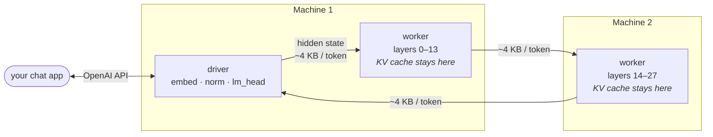

# Computer Soup

**Run an LLM that's too big for one machine — split across the machines you already own.**

Computer Soup loads a large model's transformer layers across several computers on your
network (Macs, PCs, a home lab), so a model that won't fit on any one of them runs
across all of them. No machine ever holds the whole model. It serves an
OpenAI-compatible API, so your existing chat apps just work.



Each token, only a small hidden-state vector hops from machine to machine — the
multi-gigabyte KV cache never moves. That's what makes it viable over ordinary WiFi.

```bash
soup provision --host you@other-machine --model Qwen/Qwen3-14B
soup run Qwen/Qwen3-14B --host localhost --host you@other-machine
# → open http://127.0.0.1:8000  or point any OpenAI client at :8000/v1
```

## Why

A 29 GB model doesn't fit on a 32 GB laptop with room for the OS and the KV cache.
But it fits *across* two of them. Computer Soup makes that a single command: it reads the
model's exact per-layer size, measures each machine's free RAM, auto-splits the
layers to fit, launches a shard-loading worker on each host, and serves the result.
Only one small hidden-state vector crosses the network per token — the multi-gigabyte
KV cache stays put on the machine that owns those layers.

## Quickstart

**1. Set up each machine** (idempotent — re-running is a fast "ready ✓"):

```bash
soup provision --host you@other-machine --model Qwen/Qwen3-1.7B
# slow/no internet on that host? copy the model from yours instead:
soup provision --host you@other-machine --model Qwen/Qwen3-1.7B --push-model
```

**2. Run it split** (auto-splits by each machine's free RAM):

```bash
soup run Qwen/Qwen3-1.7B --host localhost --host you@other-machine
# `soup up` does the same thing — soup up your machines
```
```
soup ▸ Qwen/Qwen3-1.7B  28 layers · 0.094 GiB/layer · head 0.58 GiB (bf16)
soup ▸ plan  localhost [0,14)   you@other-machine [14,28)
soup ▸ ready.  chat http://127.0.0.1:8000/   api http://127.0.0.1:8000/v1
```

**3. Talk to it** — open the built-in chat page, or point your own app at the API.

## Use your own chat UI

The API is OpenAI-compatible. Add `--expose` to reach it from another device, then
point Open WebUI / LibreChat / Chatbox / the `openai` SDK at `http://<driver>:8000/v1`
(no API key needed). See [docs/cluster/CONNECT_A_UI.md](docs/cluster/CONNECT_A_UI.md).

```python
from openai import OpenAI
client = OpenAI(base_url="http://127.0.0.1:8000/v1", api_key="soup")
client.chat.completions.create(model="Qwen/Qwen3-1.7B",
    messages=[{"role": "user", "content": "Hello!"}])
```

Or use the Python SDK directly:

```python
from somatic import Cluster
with Cluster.launch("Qwen/Qwen3-1.7B", ["localhost", "you@other-machine"]) as c:
    print(c.chat("Explain layer-split inference in one line."))
    for delta in c.stream("Now in French."):
        print(delta, end="", flush=True)
```

*(The package installs as `computer-soup`; the Python import name is `somatic`.)*

## Boundary modes — and prove the tradeoff yourself

Workers exchange hidden states over the network. `--mode` picks how:

| mode | wire bytes | fidelity |
|------|-----------|----------|
| `exact` | 1× | bit-identical to a single-machine run |
| `relay` (default) | ~0.5× | near-exact |
| `compact` | ~0.25× | more lossy |

Don't take it on faith — measure it for your model:

```bash
soup verify Qwen/Qwen3-1.7B --host localhost --host you@other-machine
```
reports how often each mode reproduces the exact token stream, and the wire bytes
each costs.

## Which models

Any **Llama-family** Hugging Face decoder model — Llama, Qwen, Mistral, Gemma, Phi,
DeepSeek, Yi, SmolLM. (GPT-2, GPT-NeoX and Mamba backbones aren't supported yet.)

## Requirements

Each machine needs this package, its Python deps, and the model in its Hugging Face
cache — `soup provision` sets all of that up. Remote machines need key-based SSH.
`soup run` preflights every host and refuses with a clear message if anything's
missing, rather than hanging.

## Honest limitations

- **Speed**: usable, not fast — measured 13–19 tok/s split at 1.7B and 2–4 tok/s at
  14B over home WiFi (see [BENCHMARKS.md](BENCHMARKS.md); varies with background
  load). It's a "run it on the machines you have" tool, not a production server.
- **One request at a time.** Requests are serialized (home cluster, not multi-tenant).
- **No auth.** `--expose` opens the API to your LAN — only on a network you trust.

## Commands

| command | what it does |
|---------|--------------|
| `soup provision --host … [--model M]` | set up a machine (code + deps + model cache) |
| `soup run M --host a --host b [--expose] [--mode …]` | auto-split and serve (alias: `soup up`) |
| `soup verify M --host …` | measure each mode's fidelity + wire bytes |
| `soup bench M --host …` | reproducible tok/s + % of the memory-bandwidth frontier |
| `soup ps` / `soup down [--sweep]` | list / stop clusters |

Full guide: [docs/cluster/RUN.md](docs/cluster/RUN.md).

## Benchmarks

A **measured head-to-head vs llama.cpp** — same two Macs, same models, same F16
precision — plus the roofline that explains it, in [BENCHMARKS.md](BENCHMARKS.md).
The honest short version:

- With the **MLX backend** (Apple Silicon, [docs/cluster/MLX_BACKEND.md](docs/cluster/MLX_BACKEND.md)),
  Computer Soup measured **faster than llama.cpp both single-machine (35 vs 30 tok/s at 1.7B)
  and split (13–19 vs 5.5)**. The original PyTorch backend loses single-machine (17 vs 30).
- **Going to a 2-machine split**, llama.cpp's generic RPC drops 5.5× while Computer Soup's
  purpose-built pipeline drops ~2× — the architectural gap, independent of backend.
- When **14B is too big for one machine**, that machine hits the memory-pressure cliff
  (1.43 tok/s); Computer Soup across two decodes it at 2.0–4.3 tok/s, and its shard-local
  loading starts over home WiFi where llama.cpp's weight-shipping RPC stalls.

```bash
soup bench Qwen/Qwen3-14B --host localhost --host you@other-machine
```

## License

Apache-2.0. See [LICENSE](LICENSE).
